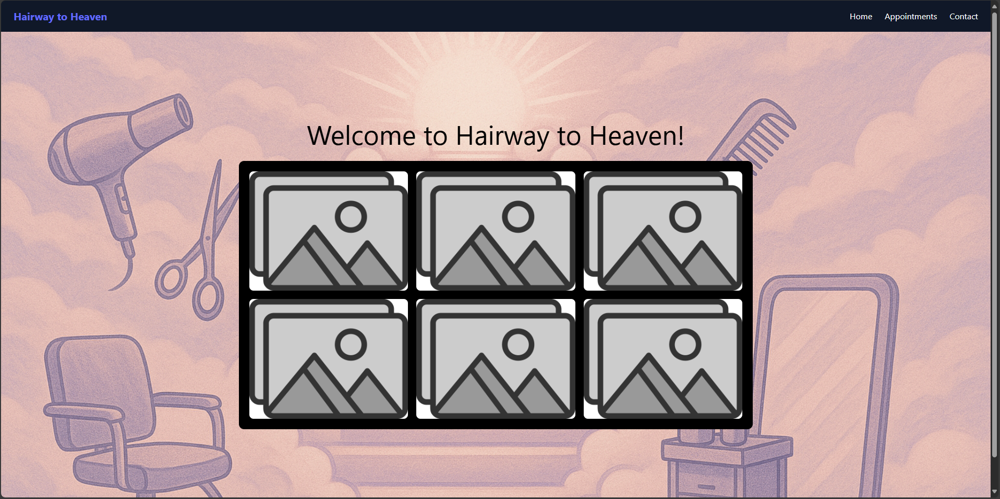
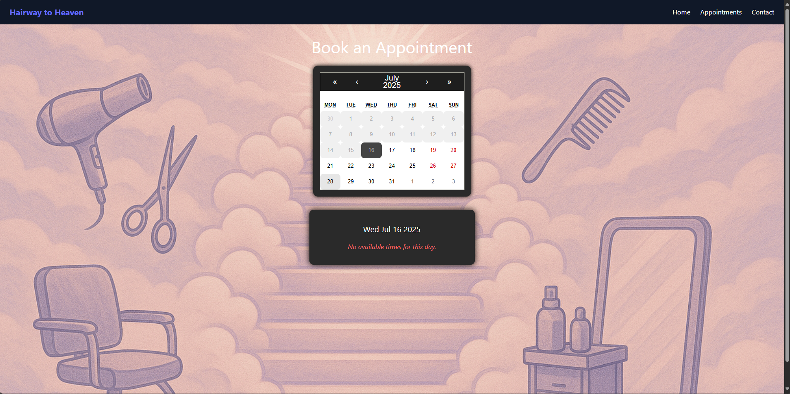
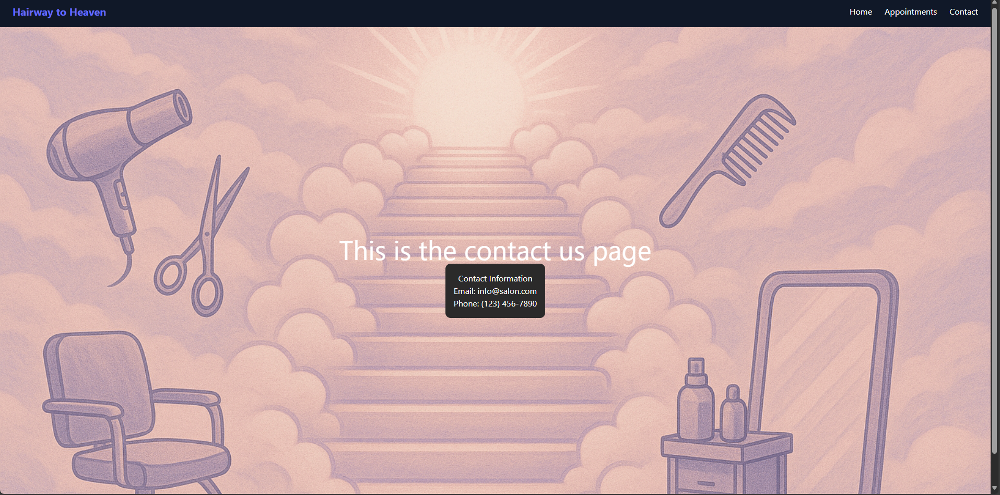

# Salon App

## This is a work in progress.

This is a website I am developing for personal experience as well as business use for my wife.

This will be a website that has a home page, appointments page, and contact page. 
It is built using React, JavaScript, CSS, Node.js, and PostgreSQL via Supabase. It is bundled with Vite to allow easy hosting on Netlify. 

## Home Page:
  - Shows a greeting
  - Shows past works in pictures
  - NavBar will be present on each page
  - Currently waiting on pictures, placeholder images placed for now. Styling will be updated once pictures are received. 
    
## Appointments Page:
  - Shows a calendar with available dates and times to schedule appointments
  - Allows the user to submit a request online for a scheduled time
  - This will be done via connecting the project to a Supabase database. It is already created and ready to connect via API
    
## Contact Page:
  - A simple contact page that shows how to get in touch
  - Ideally, add functionality such as a button that opens up the email app with the address already entered for ease of use. Simple features like this will be considered once the major steps are completed.

## Getting Started

1. **Clone the repository:**
   ```
   git clone https://github.com/colecoombs/salon-web-app.git
   cd salon-web-app
   ```

2. **Install dependencies:**
   ```
   npm install
   ```

3. **Start the development server:**
   ```
   npm run dev
   ```

4. **Open your browser and visit:**
   ```
   http://localhost:5173
   ```

## Screenshots







## About

## Contributors

My brother is listed as a contributor on this project as I am also teaching him the basics of programming. 

---

**Optional:**  
To check for code style issues, run:
```
npm run lint
```